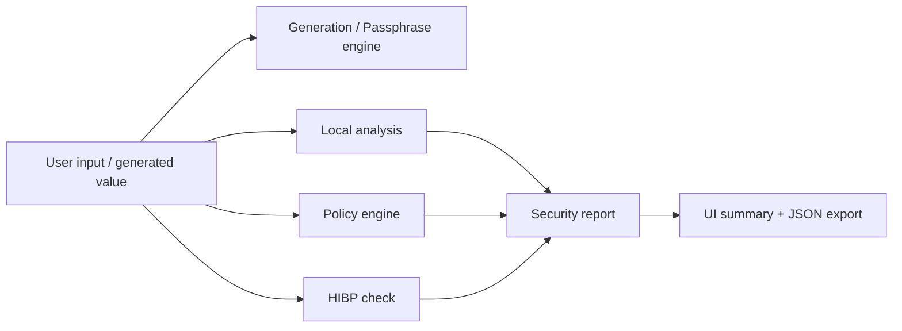

# Password Security Toolkit

A browser-based security toolkit for locally generating, analyzing, evaluating, and reporting password quality without storing sensitive values.

## Features

- Secure password generation using the browser Web Crypto API.
- Passphrase generation based on a local word list and secure random selection.
- Local password analysis for length, composition, entropy, common-password matches, and pattern detection.
- HIBP breach status checks using k-anonymity and local comparison.
- A separate policy engine for configurable compliance checks.
- A structured security report with findings and JSON export.
- Local-only operation with no server backend, account system, or persistent credential storage.

## Architecture



## Security Design

The toolkit is intentionally organized around separate concerns:

- Generation handles randomized value creation.
- Analysis measures local characteristics, entropy, and heuristics.
- Breach intelligence checks the HIBP Pwned Passwords dataset via k-anonymity.
- Policy enforcement evaluates compliance against a configurable rule set.
- Reporting aggregates findings and recommendations without exposing sensitive values.

The design avoids combining strength, breach exposure, and policy compliance into a single misleading score.

## Privacy Model

The application never persists or transmits the full password. The password is handled in-browser only for local analysis and, if requested, for a local HIBP hash workflow. No password is written to localStorage or sessionStorage.

The tool deliberately avoids analytics, telemetry, cloud storage, and backend processing.

## HIBP k-Anonymity

When breach checking is requested:

1. The browser hashes the password locally with SHA-1.
2. Only the first five characters of the hash are sent to the HIBP range API.
3. The remaining hash suffix stays in-browser.
4. The suffix is compared locally against the returned response.

This reduces plaintext and full-hash exposure, but it does not make the network request anonymous. Network metadata, destination timing, and browser/network context may still be visible.

## Password Analysis

Analysis is local and heuristic. It reports:

- length and composition
- uppercase/lowercase/digit/symbol presence
- entropy estimate
- common-password matches
- repeated and sequential patterns
- predictable suffix and prefix heuristics
- warnings and recommendations

The entropy result is a theoretical estimate and should not be treated as a real-world crack-time guarantee.

## Policy Engine

The policy engine evaluates whether a password satisfies a configured policy without performing network requests. It supports minimum and maximum length, character-class requirements, diversity requirements, common-password rejection, repeated pattern rejection, sequential pattern rejection, and optional breach-based rejection.

The policy result remains independent from local strength and HIBP breach status.

## Reporting

Security reporting aggregates the local analysis, policy compliance, and breach outcome into a structured summary that includes:

- high-level assessment
- findings
- recommendations
- metadata
- JSON export

The generated report is intentionally sanitized and does not include plaintext passwords or HIBP hash data.

## Testing

The project includes unit tests for generation, validation, entropy, pattern detection, HIBP handling, policy checks, and report sanitization.

Run:

```bash
npm test
npm run lint
npm run build
```

## Limitations

- Entropy is an estimate, not a crack-time guarantee.
- Pattern detection is heuristic and may produce false positives or miss edge cases.
- HIBP "not found" does not prove a password is safe.
- Breach databases are incomplete.
- Password security depends on reuse, context, and surrounding systems.
- The toolkit is an assessment aid, not a guarantee of security.

## Installation

```bash
npm install
npm run dev
```

## Usage

1. Generate or enter a password.
2. Run local analysis.
3. Review breach status if needed.
4. Evaluate policy compliance.
5. Review the structured security report.
6. Export the JSON report if desired.

## Security Considerations

- Prefer a password manager for long-term credential storage.
- Use unique values per service.
- Treat breach exposure as a rotation event.
- Treat local heuristics as decision support, not proof.
- Do not assume a password is safe because it is not found in one dataset.

## Disclaimer

This toolkit is intended for local security review and educational use. It does not replace a full security program, a password-manager policy, identity controls, or a formal risk assessment.

Password
	|
	v
Local SHA-1
	|
	v
5-character prefix ----------> HIBP range endpoint
	|                                  |
	|                                  v
	|                            Hash suffixes
	|                                  |
	+---------- local comparison <-----+
						  |
						  v
				  Breach result
```

The breach request is explicit; analyzing a password does not automatically contact HIBP. A successful response produces either `found` with an occurrence count or `not_found`. A failed request is reported as unavailable and is never presented as proof that the password is safe.

K-anonymity prevents the plaintext password and complete hash from being sent to HIBP, but it does not make the network request anonymous. The destination, timing, IP address, and browser or network metadata may still be visible to network infrastructure. No API key, analytics, telemetry, or breach-result cache is used.

If Web Crypto is unavailable, the application refuses to perform the check rather than sending plaintext or using an insecure fallback. Network failures, HTTP errors, rate limiting, and malformed responses fail safely.

## Development

```text
npm install
npm run dev
```

Run the checks with:

```text
npm test
npm run lint
npm run build
```

## Security Considerations and Limitations

- This release implements secure generation, local password analysis, and explicit HIBP password breach checking. Policy analysis and reporting are not implemented yet.
- Entropy is an estimate based on observed character categories; it does not account for password reuse, leaks, attacker dictionaries, or all human-choice behavior.
- Pattern detection is heuristic and may miss patterns or produce occasional false positives. It should support, not replace, expert review and password-manager guidance.
- Clipboard access depends on browser permissions and secure-context support. If it fails, the value remains available for manual copying.
- The generated value is visible in the page and may be observed by screen readers, browser extensions, screenshots, or shoulder surfers.
- Analysis input is masked and can be cleared, but browsers and extensions may still inspect page contents while the value is entered.
- The bundled passphrase list is intentionally local and modest in size. Future releases may use a larger reviewed list while keeping selection local and cryptographically random.
- Development dependencies should be kept updated and audited before production deployment.

## License

This project currently does not have a license specified.
